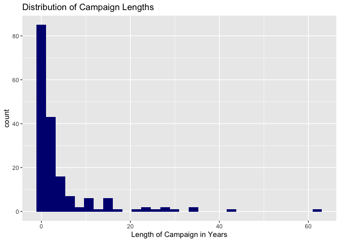

Parallel Institutions and Civil Resistance
================

### Variable Characteristics

<!-- -->

### Longevity Models

<table style="text-align:center"><tr><td colspan="2" style="border-bottom: 1px solid black"></td></tr><tr><td style="text-align:left"></td><td><em>Dependent variable:</em></td></tr>
<tr><td></td><td colspan="1" style="border-bottom: 1px solid black"></td></tr>
<tr><td style="text-align:left"></td><td>length_camp</td></tr>
<tr><td colspan="2" style="border-bottom: 1px solid black"></td></tr><tr><td style="text-align:left">Log(GDP Per Capita)</td><td>-0.331</td></tr>
<tr><td style="text-align:left"></td><td>(0.646)</td></tr>
<tr><td style="text-align:left"></td><td></td></tr>
<tr><td style="text-align:left">Past or Present Colony</td><td>1.250</td></tr>
<tr><td style="text-align:left"></td><td>(1.257)</td></tr>
<tr><td style="text-align:left"></td><td></td></tr>
<tr><td style="text-align:left">Violent of Campaign</td><td>3.314*</td></tr>
<tr><td style="text-align:left"></td><td>(1.702)</td></tr>
<tr><td style="text-align:left"></td><td></td></tr>
<tr><td style="text-align:left">Security Force Defections</td><td>-2.457*</td></tr>
<tr><td style="text-align:left"></td><td>(1.389)</td></tr>
<tr><td style="text-align:left"></td><td></td></tr>
<tr><td style="text-align:left">Repression of Campaign</td><td>0.742</td></tr>
<tr><td style="text-align:left"></td><td>(0.898)</td></tr>
<tr><td style="text-align:left"></td><td></td></tr>
<tr><td style="text-align:left">Media Coverage</td><td>-2.248**</td></tr>
<tr><td style="text-align:left"></td><td>(0.878)</td></tr>
<tr><td style="text-align:left"></td><td></td></tr>
<tr><td style="text-align:left">Indiscriminate Violence by Regime</td><td>-2.553*</td></tr>
<tr><td style="text-align:left"></td><td>(1.303)</td></tr>
<tr><td style="text-align:left"></td><td></td></tr>
<tr><td style="text-align:left">Campaign Support</td><td>-1.059</td></tr>
<tr><td style="text-align:left"></td><td>(1.312)</td></tr>
<tr><td style="text-align:left"></td><td></td></tr>
<tr><td style="text-align:left">Campaign Size</td><td>-0.088</td></tr>
<tr><td style="text-align:left"></td><td>(0.614)</td></tr>
<tr><td style="text-align:left"></td><td></td></tr>
<tr><td style="text-align:left">Regime Support of Campaign</td><td>-3.194***</td></tr>
<tr><td style="text-align:left"></td><td>(1.182)</td></tr>
<tr><td style="text-align:left"></td><td></td></tr>
<tr><td style="text-align:left">International Sanctions of Regime</td><td>0.707</td></tr>
<tr><td style="text-align:left"></td><td>(1.726)</td></tr>
<tr><td style="text-align:left"></td><td></td></tr>
<tr><td style="text-align:left">Educational Systems</td><td>3.557</td></tr>
<tr><td style="text-align:left"></td><td>(6.347)</td></tr>
<tr><td style="text-align:left"></td><td></td></tr>
<tr><td style="text-align:left">Law Enforcement</td><td>1.306</td></tr>
<tr><td style="text-align:left"></td><td>(9.172)</td></tr>
<tr><td style="text-align:left"></td><td></td></tr>
<tr><td style="text-align:left">Social Welfare</td><td>-0.635</td></tr>
<tr><td style="text-align:left"></td><td>(2.138)</td></tr>
<tr><td style="text-align:left"></td><td></td></tr>
<tr><td style="text-align:left">Traditional Media</td><td>1.773</td></tr>
<tr><td style="text-align:left"></td><td>(2.219)</td></tr>
<tr><td style="text-align:left"></td><td></td></tr>
<tr><td style="text-align:left">New Media</td><td>-0.235</td></tr>
<tr><td style="text-align:left"></td><td>(4.937)</td></tr>
<tr><td style="text-align:left"></td><td></td></tr>
<tr><td style="text-align:left">Judicial System</td><td>2.948</td></tr>
<tr><td style="text-align:left"></td><td>(3.989)</td></tr>
<tr><td style="text-align:left"></td><td></td></tr>
<tr><td style="text-align:left">Violence * Education</td><td>-10.701</td></tr>
<tr><td style="text-align:left"></td><td>(7.537)</td></tr>
<tr><td style="text-align:left"></td><td></td></tr>
<tr><td style="text-align:left">Violence * Social Welfare</td><td>9.919*</td></tr>
<tr><td style="text-align:left"></td><td>(5.565)</td></tr>
<tr><td style="text-align:left"></td><td></td></tr>
<tr><td style="text-align:left">Violence * Traditional Media</td><td>2.591</td></tr>
<tr><td style="text-align:left"></td><td>(3.020)</td></tr>
<tr><td style="text-align:left"></td><td></td></tr>
<tr><td style="text-align:left">Violence * New Media</td><td>9.008</td></tr>
<tr><td style="text-align:left"></td><td>(5.781)</td></tr>
<tr><td style="text-align:left"></td><td></td></tr>
<tr><td style="text-align:left">Violence * Courts</td><td>-0.191</td></tr>
<tr><td style="text-align:left"></td><td>(4.542)</td></tr>
<tr><td style="text-align:left"></td><td></td></tr>
<tr><td style="text-align:left">Violence * Police</td><td>-4.690</td></tr>
<tr><td style="text-align:left"></td><td>(9.955)</td></tr>
<tr><td style="text-align:left"></td><td></td></tr>
<tr><td style="text-align:left">Constant</td><td>8.572</td></tr>
<tr><td style="text-align:left"></td><td>(6.111)</td></tr>
<tr><td style="text-align:left"></td><td></td></tr>
<tr><td colspan="2" style="border-bottom: 1px solid black"></td></tr><tr><td style="text-align:left">Observations</td><td>178</td></tr>
<tr><td style="text-align:left">R2</td><td>0.363</td></tr>
<tr><td style="text-align:left">Adjusted R2</td><td>0.268</td></tr>
<tr><td style="text-align:left">F Statistic</td><td>88.379***</td></tr>
<tr><td colspan="2" style="border-bottom: 1px solid black"></td></tr><tr><td style="text-align:left"><em>Note:</em></td><td style="text-align:right">*p<0.1; **p<0.05; ***p<0.01</td></tr>
</table>
