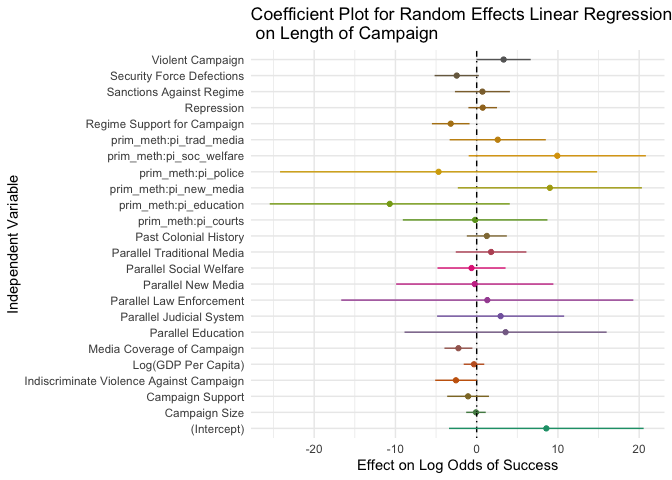
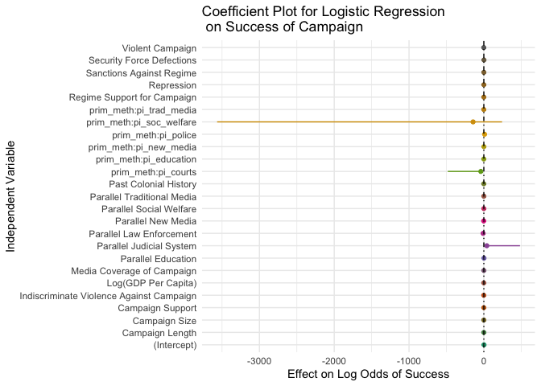
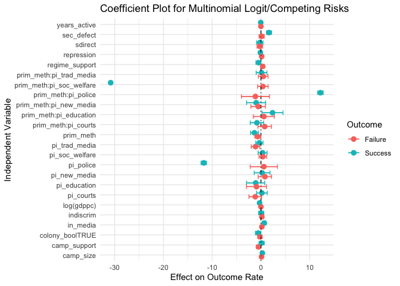

Parallel Institutions and Civil Resistance
================

What is the impact of parallel institution-building on non-state actors’
strategic campaigns? Non-state campaigns, both violent and nonviolent,
occasionally attempt to develop independent institutions for the
provision of public goods and services and for the execution of
political tasks. In this paper, I employ the Nonviolent and Violent
Campaign Outcomes 2.1 (NAVCO) dataset to measure how building parallel
institutions affects the longevity and success rates of campaigns. Using
survival analysis, I show that education and social welfare institutions
can help campaigns achieve their goals, but that this effect diverges
based on the violence of a campaign.

### Hypotheses

- **Hypothesis 1**: Social welfare and educational institutions help
  political resistance campaigns achieve their goals.
- **Hypothesis 2**: Campaigns with traditional or new media systems last
  longer and have higher rates of success than those without.
- **Hypothesis 3**: Violent campaigns are benefitted by building
  education systems, while nonviolent campaigns are benefitted by social
  welfare systems.

### Variable Characteristics

<!-- -->

### Longevity Models

<!-- -->

### Binomial Logistic Regression

<!-- -->

### Multinomial Logistic Regression

    ## # weights:  78 (50 variable)
    ## initial  value 2074.180001 
    ## iter  10 value 958.250945
    ## iter  20 value 847.912780
    ## iter  30 value 762.639838
    ## iter  40 value 754.566171
    ## iter  50 value 754.435347
    ## iter  60 value 754.419855
    ## final  value 754.417359 
    ## converged

<!-- -->
