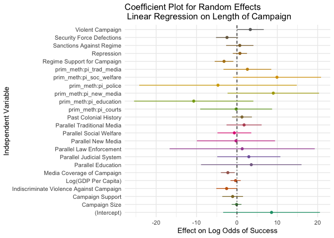

Parallel Institutions and Civil Resistance
================

What is the impact of parallel institution-building on non-state actors’
strategic campaigns? Non-state campaigns, both violent and nonviolent,
occasionally attempt to develop independent institutions for the
provision of public goods and services and for the execution of
political tasks. In this paper, I employ the Nonviolent and Violent
Campaign Outcomes 2.1 (NAVCO) dataset to measure how building parallel
institutions affects the longevity and success rates of campaigns. Using
survival analysis, I show that education and social welfare institutions
can help campaigns achieve their goals, but that this effect diverges
based on the violence of a campaign.

- [Hypotheses](#Hypotheses)
- [DVs and IVs](#Dependent-and-Independent-Variables)
- [Methods](#Methods)
- [Variable Characteristics](#Variable-Characteristics)
- [Longevity Models](#Longevity-Models)
- [Binomial Logistic Regression](#Binomial-Logistic-Regression)
- [Multinomial Logistic Regression](#Multinomial-Logistic-Regression)
- [Proportional Hazard Models](#Proportional-Hazard-Models)
- [Results](#Results)

### Hypotheses

- **Hypothesis 1**: Social welfare and educational institutions help
  political resistance campaigns achieve their goals.
- **Hypothesis 2**: Campaigns with traditional or new media systems last
  longer and have higher rates of success than those without.
- **Hypothesis 3**: Violent campaigns are benefitted by building
  education systems, while nonviolent campaigns are benefitted by social
  welfare systems.

### Dependent and Independent Variables

**DV**: Campaign length; campaign success or failure.

**IV**: Parallel institutions:

- Law Enforcement
- Education
- Social Welfare
- Traditional Media
- New Media
- Courts

Condition:

- Violence or nonviolence of campaign

### Methods

- Random Effects Linear Regression: Campaign Length vs. Parallel
  Institutions
- Binomial Logistic Regression: Campaign Success vs. Parallel
  Institutions
- Multinomial Logistic Regression: Campaign Success OR Failure
  vs. Parallel Institutions
- Competing Risks Survival Analysis: Campaign Success Hazard Rates on
  Parallel Institutions, with Failure as Competing Event

### Variable Characteristics

<!-- -->

### Longevity Models

<!-- -->

### Binomial Logistic Regression

<!-- -->

### Multinomial Logistic Regression

    ## # weights:  78 (50 variable)
    ## initial  value 2074.180001 
    ## iter  10 value 958.250945
    ## iter  20 value 847.912780
    ## iter  30 value 762.639838
    ## iter  40 value 754.566171
    ## iter  50 value 754.435347
    ## iter  60 value 754.419855
    ## final  value 754.417359 
    ## converged

<!-- -->

### Proportional Hazard Models

| term                     |    estimate | std.error |  statistic |   p.value |
|:-------------------------|------------:|----------:|-----------:|----------:|
| (Intercept)              |   8.5723690 | 6.1110952 |  1.4027550 | 0.1606899 |
| log(gdppc)               |  -0.3313861 | 0.6461087 | -0.5128953 | 0.6080246 |
| colony                   |   1.2496758 | 1.2574850 |  0.9937898 | 0.3203252 |
| prim_meth                |   3.3143571 | 1.7020284 |  1.9472984 | 0.0514990 |
| sec_defect               |  -2.4571498 | 1.3894180 | -1.7684742 | 0.0769817 |
| repression               |   0.7420625 | 0.8975595 |  0.8267558 | 0.4083755 |
| in_media                 |  -2.2476339 | 0.8779363 | -2.5601333 | 0.0104632 |
| indiscrim                |  -2.5530272 | 1.3029846 | -1.9593688 | 0.0500696 |
| camp_support             |  -1.0591112 | 1.3115756 | -0.8075106 | 0.4193724 |
| camp_size                |  -0.0881601 | 0.6139894 | -0.1435857 | 0.8858276 |
| regime_support           |  -3.1943939 | 1.1817516 | -2.7031010 | 0.0068696 |
| sdirect                  |   0.7069433 | 1.7260638 |  0.4095696 | 0.6821217 |
| pi_education             |   3.5572919 | 6.3471370 |  0.5604561 | 0.5751683 |
| pi_police                |   1.3056433 | 9.1716378 |  0.1423566 | 0.8867983 |
| pi_soc_welfare           |  -0.6345128 | 2.1378162 | -0.2968042 | 0.7666160 |
| pi_trad_media            |   1.7727539 | 2.2185545 |  0.7990581 | 0.4242567 |
| pi_new_media             |  -0.2350258 | 4.9374685 | -0.0476005 | 0.9620347 |
| pi_courts                |   2.9477555 | 3.9890796 |  0.7389563 | 0.4599335 |
| prim_meth:pi_education   | -10.7011588 | 7.5367108 | -1.4198712 | 0.1556452 |
| prim_meth:pi_soc_welfare |   9.9191908 | 5.5645314 |  1.7825743 | 0.0746556 |
| prim_meth:pi_trad_media  |   2.5912823 | 3.0197197 |  0.8581201 | 0.3908261 |
| prim_meth:pi_new_media   |   9.0076328 | 5.7808834 |  1.5581758 | 0.1191916 |
| prim_meth:pi_courts      |  -0.1905214 | 4.5415416 | -0.0419508 | 0.9665379 |
| prim_meth:pi_police      |  -4.6898528 | 9.9552251 | -0.4710946 | 0.6375732 |

### Results

#### Campaign Length

- No independent variable of interest has a clear impact on campaign
  length; educational institutions *may* have a slight conditional
  effect with the violence of the campaign.
- Media coverage shortens campaigns.

#### Campaign Success

- Across all model specifications, education and social welfare have the
  strongest effects on success rates.
- Both competing risks and multinomial logit show that violent campaigns
  are harmed by building social welfare systems and helped by building
  educational systems.
  - These results are significant at least at the .1 level in the
    competing risks regression.
- I replicate previous findings that nonviolent tactics, security force
  defections, campaign size, and campaign support from the regime have
  significant positive effects on success rates. International support
  of the regime and repression of the campaign have significant negative
  impacts.
